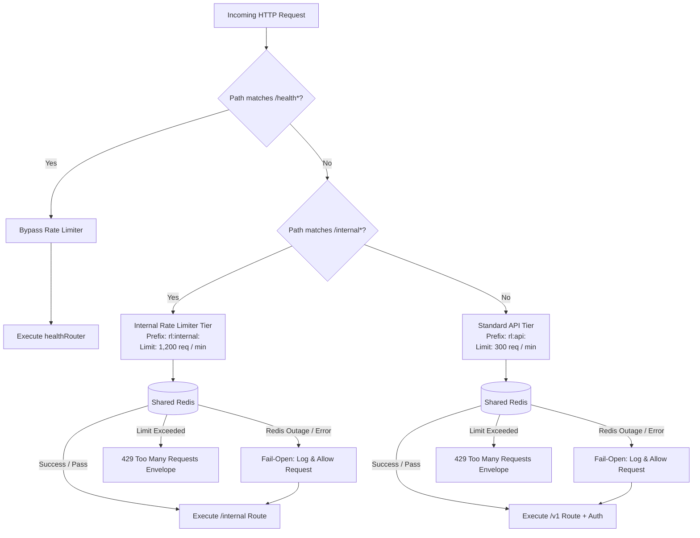

# Rate Limiting Runbook & Architecture Guide(Krish Parmar)

| Metadata | Details |
| :--- | :--- |
| **Service** | `apps/api` (Founder Intelligence Platform API) |
| **Component** | Redis-Backed Rate Limiting Middleware |
| **Owner / Squad** | Krish Parmar (`KRISH-0201`) / WS1 API Squad |
| **Sprint / Issue** | Sprint 1 — Issue #3 (`S1-3 Redis-backed rate limiting`) |
| **Status** | Production Ready |
| **Last Updated** | September 2026 |

---

## 1. Executive Summary & Architecture

The Founder Intelligence API utilizes a distributed, Redis-backed rate limiting architecture using [`express-rate-limit`](https://www.npmjs.com/package/express-rate-limit) and [`rate-limit-redis`](https://www.npmjs.com/package/rate-limit-redis). 

State is synchronized across all API server replicas in Redis using dedicated key namespaces, preventing multi-instance counter drift or bypass attacks.



---

## 2. Rate Limit Tiers & Policies

| Tier | Path Pattern | Redis Prefix | Window (`windowMs`) | Request Limit | Description |
| :--- | :--- | :--- | :--- | :--- | :--- |
| **Health Exemption** | `/health*` (`/health`, `/health/ready`, etc.) | *None (Bypassed)* | N/A | **Unlimited** | Kubernetes liveness/readiness probes and internal uptime monitoring. |
| **Internal Tier** | `/internal/*` | `rl:internal:` | 60,000 ms (1 min) | **1,200 req / min** (20 rps) | Higher throughput for background AI workers, schedulers, and internal microservices. |
| **Standard API** | All other endpoints (e.g. `/v1/*`) | `rl:api:` | 60,000 ms (1 min) | **300 req / min** (5 rps) | Normal public & authenticated user sessions. |

### Why 1,200 req/min for `/internal`?
Internal services (such as the Python Celery worker querying run statuses or automated job triggers) have higher legitimate traffic volume and lower latency tolerance than human browser clients. 1,200 requests/minute provides sufficient capacity (4x standard tier) for high-frequency internal worker loops while still protecting the database from runaway recursion or unbounded task scheduling.

### Independent Key Counters
Each tier enforces a strict key prefix:
- Normal API: `rl:api:<client-ip>`
- Internal API: `rl:internal:<client-ip>`

Because key prefixes are completely separated and routing middleware selectively skips non-applicable tiers, a spike in normal user traffic will never consume the rate-limit budget of internal services, and vice versa.

---

## 3. Fail-Open Architecture

A core platform guarantee is **Fail-Open Resilience**:
> **Redis unavailability or store network latency must never cause application downtime or artificial HTTP 500 / 429 errors.**

### Implementation Mechanics
1. **`SafeRedisStore` Subclass**: Wraps `RedisStore` to intercept both initialization (`init`) and per-request increments (`increment`).
2. **Boot-Time Resilience**: If Redis is temporarily down during API startup, `init()` catches the connection error and logs a warning instead of allowing an unhandled promise rejection to crash the process.
3. **Auto-Recovery**: If a script load failed during a Redis outage, `SafeRedisStore.increment()` automatically attempts to reload the required Lua scripts as soon as Redis connectivity is re-established.
4. **`passOnStoreError: true`**: Configured in `express-rate-limit`. Whenever the Redis store throws an error during command execution, `express-rate-limit` catches it, ensures no 500/429 is emitted, and immediately invokes `next()`, allowing the client request to proceed normally.

---

## 4. Structured Logging & Security Hygiene

All rate limiter store failures and command issues are logged through the application’s structured Pino logger (`src/lib/logger.ts`).

### Example Error Log
```json
{
  "level": 50,
  "time": 1727339100000,
  "prefix": "rl:api:",
  "command": "EVALSHA",
  "err": {
    "type": "Error",
    "message": "connect ECONNREFUSED 127.0.0.1:6379",
    "stack": "Error: connect ECONNREFUSED..."
  },
  "msg": "Redis rate-limit store increment failed; failing open"
}
```

### Security & Privacy Protections
In accordance with platform security standards:
- **No Redis credentials** or connection strings are ever logged.
- **No authentication tokens**, bearer headers, or session cookies are logged.
- **No sensitive request bodies or parameters** are exposed in rate-limiting logs.
- Headers are sanitized by Pino's redaction policy (`redact: ["req.headers.authorization"]`).

---

## 5. HTTP Response Format & Standard Headers

### 1. Rate Limit Exceeded (HTTP 429)
When a client exceeds their tier limit, the API responds with HTTP 429 and the uniform platform error envelope:
```json
{
  "error": {
    "code": "RATE_LIMIT_EXCEEDED",
    "message": "Too many requests, please try again later.",
    "requestId": "req_01j8..."
  }
}
```

### 2. Standard IETF Headers
The API transmits standard draft-7 rate limiting headers:
- `RateLimit-Limit`: Maximum requests permitted within the window (e.g. `300` or `1200`).
- `RateLimit-Remaining`: Number of requests remaining in current window.
- `RateLimit-Reset`: Number of seconds until the current window resets.

---

## 6. Configuration & Environment Variables

Limits can be tuned at runtime or in staging/production environments via `.env`:

| Environment Variable | Default Value | Description |
| :--- | :--- | :--- |
| `REDIS_URL` | `redis://localhost:6379` | Connection URI for the shared Redis instance. |
| `RATE_LIMIT_WINDOW_MS` | `60000` | Window duration in milliseconds (default: 60s). |
| `RATE_LIMIT_API_LIMIT` | `300` | Max requests per window for standard API tier. |
| `RATE_LIMIT_INTERNAL_LIMIT`| `1200` | Max requests per window for internal service tier. |

### How to Adjust Limits
To modify limits in production without modifying code:
1. Update `RATE_LIMIT_API_LIMIT` or `RATE_LIMIT_INTERNAL_LIMIT` in deployment environment settings.
2. Trigger a rolling restart of the `api` service.
3. Verify via `GET /v1/workspaces` response headers (`RateLimit-Limit: <new_value>`).

---

## 7. Incident Response & Disaster Recovery

### Scenario A: Redis Cluster Outage
- **Symptoms**: `Redis rate-limit store increment failed; failing open` logged in Pino. `/health/ready` reports `checks.redis: false`.
- **User Impact**: **None**. All API routes continue processing requests normally due to fail-open design.
- **Action**:
  1. Check Redis container/cluster status: `docker compose ps redis` or cloud provider dashboard.
  2. Inspect Redis logs for memory pressure, OOM events, or network timeouts.
  3. Restart Redis instance.
  4. Once Redis is reachable, the rate limiter automatically reconnects without requiring an API reboot.

### Scenario B: Legitimate Client Rate-Limited (429)
- **Symptoms**: User or internal service reports HTTP 429 `RATE_LIMIT_EXCEEDED`.
- **Action**:
  1. Inspect `RateLimit-Reset` response header to identify cooldown duration.
  2. Verify if the caller is an internal service using standard endpoints instead of `/internal/*`.
  3. If traffic surge is expected (e.g. bulk batch ingestion), temporarily increase `RATE_LIMIT_API_LIMIT` or route via an authenticated internal service token.

---

## 8. Verification & Test Suite

Automated verification is covered in `apps/api/test/rateLimit.test.ts`:
- **Test 1**: Normal tier rate limiting and 429 envelope format.
- **Test 2**: Verification of Redis store key prefix (`rl:api:` vs `rl:internal:`).
- **Test 3**: `/health*` endpoints completely bypass rate limiting.
- **Test 4**: Independent counter isolation between internal and standard tiers.
- **Test 5**: Fail-open behavior and structured error logging when Redis fails.